# Описание процесса разработки

> Документ ведётся по ходу работы. Каждый этап: что делалось, какие решения
> приняты, какие проблемы возникли и как решены, + скриншоты.
> Скриншоты складываются в [`docs/screenshots/`](./docs/screenshots/) и
> вставляются в соответствующий этап. Плейсхолдеры помечены `🖼️ TODO`.

## Содержание

1. [Постановка задачи и разбор ТЗ](#1-постановка-задачи-и-разбор-тз)
2. [Разбор макетов Figma и дизайн-токены](#2-разбор-макетов-figma-и-дизайн-токены)
3. [Выбор стека и обоснование](#3-выбор-стека-и-обоснование)
4. [Инициализация проекта](#4-инициализация-проекта)
5. [Генерация API-клиента из Swagger](#5-генерация-api-клиента-из-swagger)
6. [Авторизация и JWT](#6-авторизация-и-jwt)
7. [Экран входа](#7-экран-входа)
8. [Список категорий](#8-список-категорий)
9. [Добавление / редактирование](#9-добавление--редактирование)
10. [Асинхронная валидация имени](#10-асинхронная-валидация-имени)
11. [Удаление](#11-удаление)
12. [Тесты и покрытие](#12-тесты-и-покрытие)
13. [Сборка](#13-сборка)
14. [Скриншоты приложения](#скриншоты-приложения)
15. [Проблемы и решения](#проблемы-и-решения)

---

## 1. Постановка задачи и разбор ТЗ

**Цель:** справочник категорий с просмотром, добавлением, изменением, удалением +
авторизация по JWT. Источники: [project.txt](./project.txt) (ТЗ),
макеты Figma, Swagger бэкенда.

Ключевые требования из ТЗ:
- Список `/categories`: поля Id, Name; пагинация скроллом (`pageNumber` с 0,
  грузить пока строк ≥ `pageSize`); поиск через `search`; сортировка по Name
  (`sortDesc`, старт `false`); скрытие элементов изменения при `canEdit = false`.
- Запись `/categories/{id}`: Id (текст, не input), Name; асинхронная серверная
  валидация имени (`name-exists`); readonly при `canEdit = false`.
- Удаление с диалогом подтверждения.
- API импортировать через `openapi-generator-cli`.

🖼️ _TODO: при необходимости — скриншот ТЗ / таблицы требований._

---

## 2. Разбор макетов Figma и дизайн-токены

Рабочий canvas — «Task for AI», 7 экранов. Отрендерены в `figma_renders/`.

Расхождения ТЗ ↔ макет ↔ API и принятые решения — см. раздел 1 в [plan.txt](./plan.txt)
(коротко: поле Description из макета не реализуем — обобщённый макет; следуем ТЗ + API).

**Дизайн-токены** (полностью — раздел 2 [plan.txt](./plan.txt)):
primary `#005baa`, danger `#a9120a`, neutral `#f4f4f5`, текст `#263238`,
шапка таблицы `#f9fafc`; шрифт Roboto; радиусы 8px (кнопки/инпуты), 10px (карточки/таблица).

Эталонные рендеры макетов:

| Экран | Макет |
|---|---|
| Авторизация | 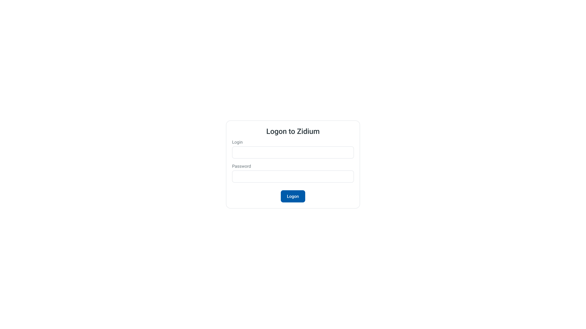 |
| Авторизация — пустые поля | 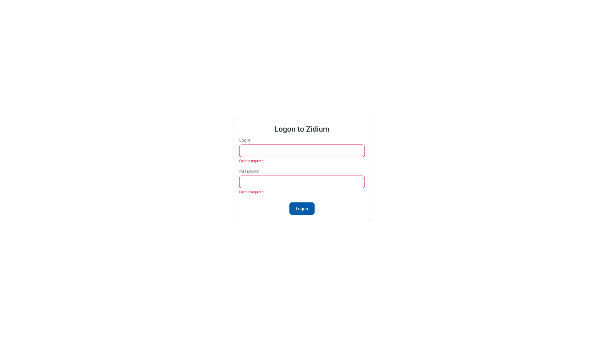 |
| Авторизация — ошибка входа | 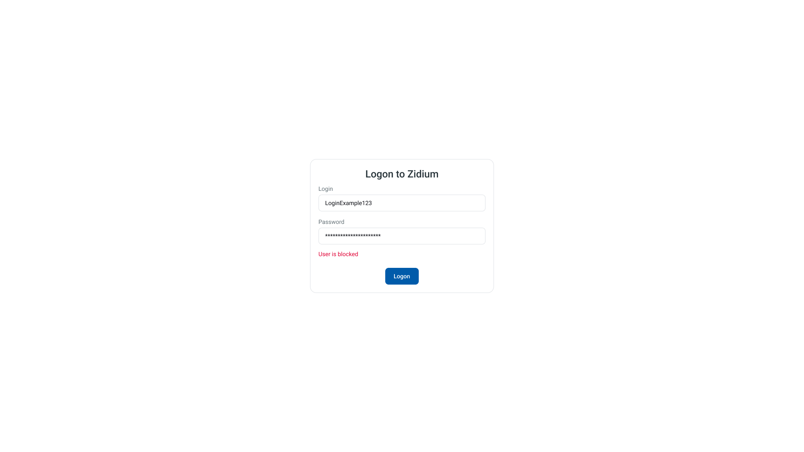 |
| Список | 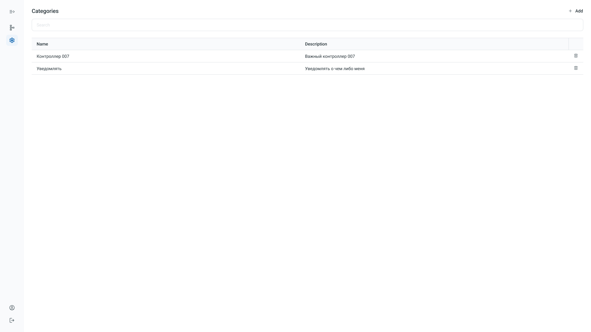 |
| Добавление | 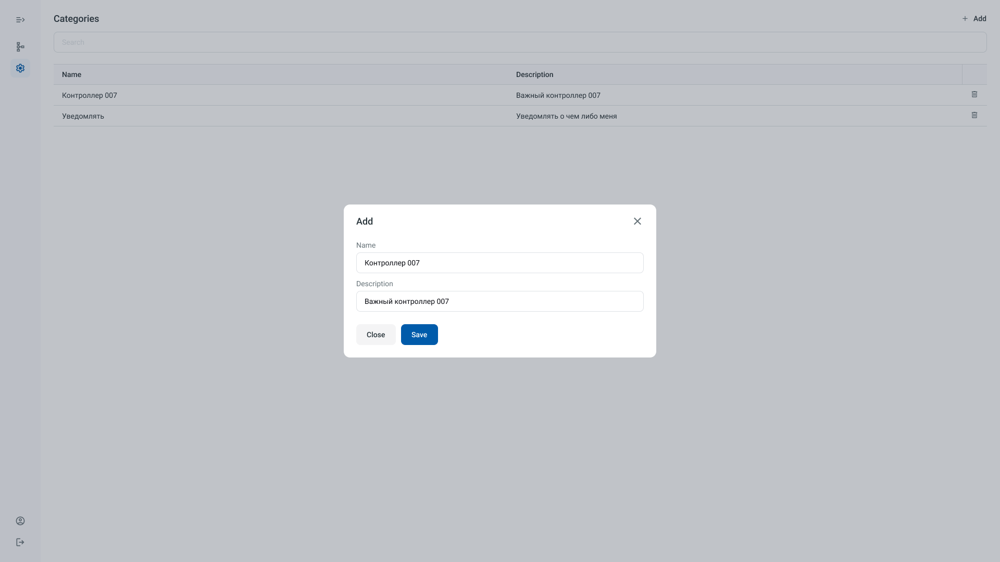 |
| Редактирование |  |
| Удаление | 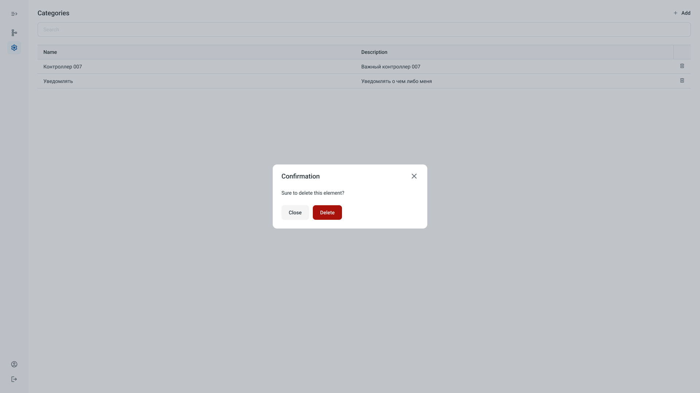 |

---

## 3. Выбор стека и обоснование

- **Angular standalone + signals** — современный подход без NgModule.
- **PrimeNG** — слои макета (`datatable`, `input`, `overlay`, `dialog`) соответствуют
  компонентам PrimeNG; тему подгоняем под токены Figma.
- **openapi-generator-cli** (`typescript-angular`) — требование ТЗ; клиент не правим руками.
- Состояние — сервисы на signals (объём не требует NgRx).

Обоснование подробно — раздел 0 [plan.txt](./plan.txt).

---

## 4. Инициализация проекта

_Что сделано:_
- Angular 20.3 (standalone, signals, SCSS), проект в `recursion-ai/`.
- Подключены PrimeNG 20 + `@primeuix/themes` + PrimeIcons + шрифт Roboto.
- Тема PrimeNG полностью на design-токенах: пресет `ZidiumPreset`
  (`core/config/theme.ts`) на базе Aura — palette primary `#005baa`, примитив `red`
  `#a9120a` (danger), радиусы `formField`/`content` (8/10px), токены `datatable.headerCell`
  (`#f9fafc`). Без `::ng-deep`. Палитра приложения (для собственных компонентов) — в `styles.scss` (`:root`).
- Структура: `core/{api,auth,config}`, `shared/validators`, `features/{auth,categories,layout}`.
- `core/config/environment.ts` (`apiBaseUrl`, относительный — через proxy),
  `core/config/constants.ts` (`PAGE_SIZE = 50`, тайминги debounce, ключи storage).
- `proxy.conf.json` проксирует `/front` → бэкенд Zidium (без CORS в dev).
- `app.config.ts`: `provideRouter(withComponentInputBinding)`,
  `provideHttpClient(withInterceptors([authInterceptor]))`,
  `provideAnimationsAsync()`, `providePrimeNG({ theme })`, `BASE_PATH`.

🖼️ Скриншот входа после `ng serve`: 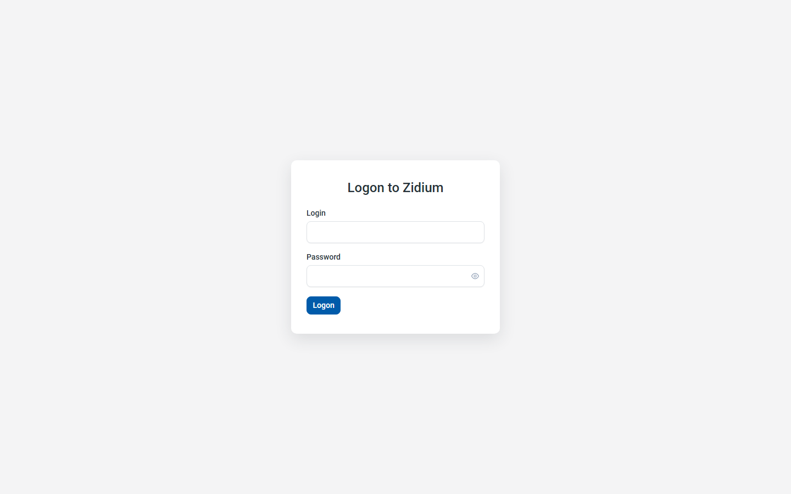

---

## 5. Генерация API-клиента из Swagger

_Что сделано:_
- Установлен `@openapitools/openapi-generator-cli`, версия генератора зафиксирована
  в `openapitools.json` (`7.10.0`).
- Скрипт `npm run gen:api`: генератор `typescript-angular`, источник —
  локальный `swagger_front.json`, выход `src/app/core/api`,
  `useSingleRequestParameter=true`, `providedIn=root`, `fileNaming=kebab-case`.
- Использован флаг `--skip-validate-spec`: в спеке есть дублирующиеся `operationId`
  в неиспользуемых эндпоинтах (`/front/components/*`, `/front/selector/*`).
- Получены сервисы `CategoriesService`, `LogonService` и DTO (`...CategoryDto`,
  `...EditCategoryDto`, `...CategoryListDto`, `LogonResponseDto`, `TokensResponseDto`, …).
- Дружелюбные алиасы длинных имён — в `core/api-types.ts` (клиент руками не правим).

_Проблема и решение:_ авто-barrel `core/api/api/api.ts` через `export *` давал
коллизии имён `*RequestParams` между эндпоинтами (TS2308). Barrel сведён к
экспорту только используемых сервисов и внесён в `.openapi-generator-ignore`.

---

## 6. Авторизация и JWT

_Что сделано:_
- `TokenStorage` — token/refreshToken в `localStorage` + реактивный signal на access-token.
- `AuthService` — `logon()`, `refresh()`, `logout()`, `loadCurrentUser()`,
  `currentUser` signal, `isAuthenticated` computed.
- `authInterceptor` (функциональный) — добавляет `Authorization: Bearer …` ко всем
  запросам, кроме `/front/logon*`; на `401` запускает refresh с защитой от
  параллельных рефрешей (single-flight через общий `BehaviorSubject`) и повторяет
  исходный запрос; при провале refresh — `logout()`.
- `authGuard` (`CanMatchFn`) — пускает только авторизованных, иначе redirect `/login`.
- Проверено: реальный вход `test / 77777` возвращает JWT (200), e2e-логин проходит.

---

## 7. Экран входа

_Что сделано:_ `LoginPage` (standalone, OnPush) — ReactiveForm `login`/`password`
(`required`), карточка по центру «Logon to Zidium» (токены Figma). Пустой сабмит →
«Field is required» под каждым полем + красная рамка. Ошибка входа от сервера →
сообщение красным (текст из ответа API, дефолт при отсутствии). Кнопка блокируется
на время запроса. Успех → redirect на `/categories`.

| Состояние | Макет | Реализация |
|---|---|---|
| Базовый |  |  |
| Пустые поля |  |  |
| Ошибка входа |  | 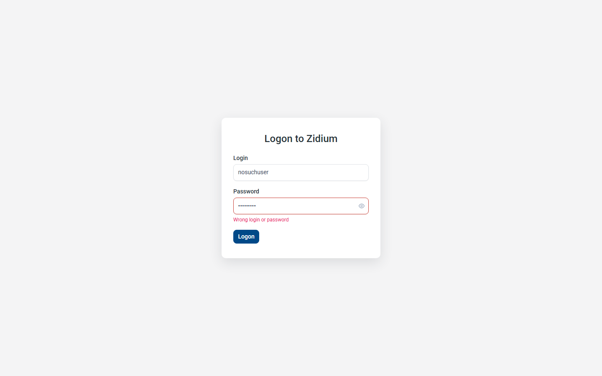 |

---

## 8. Список категорий

_Что сделано:_ `ShellLayout` (левое меню 78px) + `CategoriesListPage`.
`CategoriesStore` (signals) — `items`, `canEdit`, `search`, `sortDesc`, `loading`,
`hasMore`, `error` + методы `reload/loadNextPage/setSearch/toggleSort/removeFromList/upsert`
(иммутабельные обновления). PrimeNG Table, колонки Id/Name. Поиск — `debounceTime(300)` +
`distinctUntilChanged` → сброс пагинации. Сортировка — клик по «Name» инвертирует
`sortDesc`. Бесконечная прокрутка — `IntersectionObserver` на сентинеле (грузит,
пока `items.length === PAGE_SIZE`). При `canEdit=false` скрыты «+ Add» и иконки удаления.

| Макет | Реализация |
|---|---|
|  | 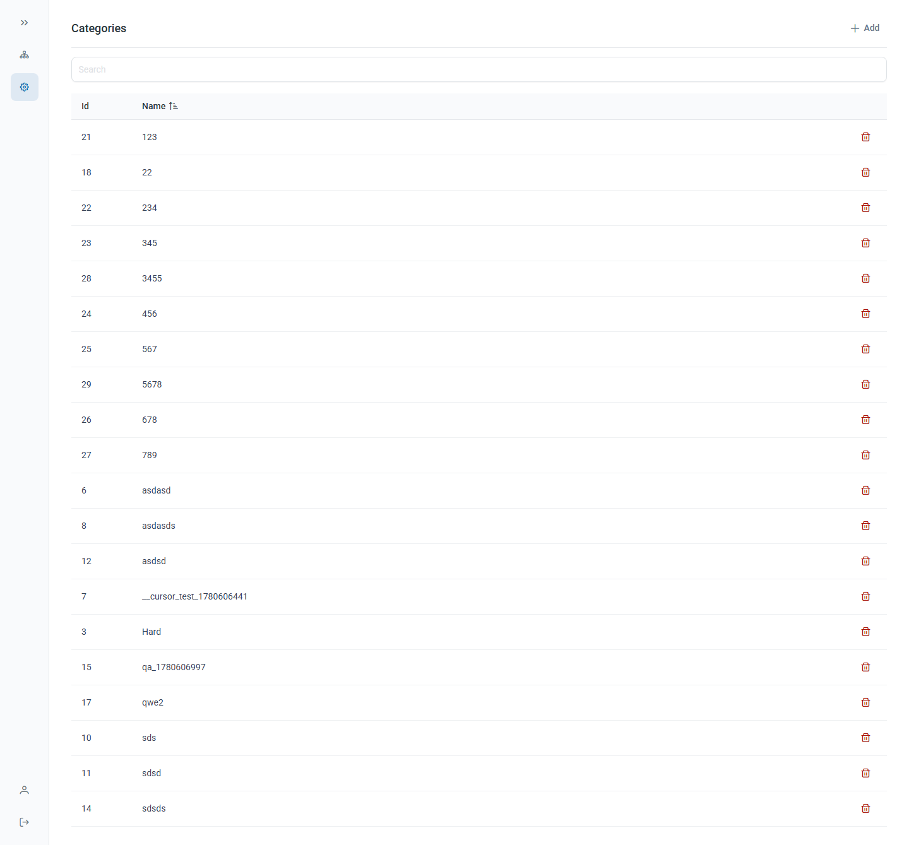 |

---

## 9. Добавление / редактирование

_Что сделано:_ Одна маршрутизируемая модалка `CategoryEditDialog` на два режима —
`/categories/new` (Add) и `/categories/:id` (Edit), `id` приходит через
`withComponentInputBinding`. В Edit при открытии `GET /front/categories/{id}` заполняет
форму; Id показан текстом (не input). Save: Add → `POST /front/categories` (новый id),
Edit → `POST /front/categories/{id}`; затем `store.upsert(...)` и закрытие модалки
(навигация назад на `/categories`). При `canEdit=false` поля readonly, Save скрыт.

| Экран | Макет | Реализация |
|---|---|---|
| Добавление |  | 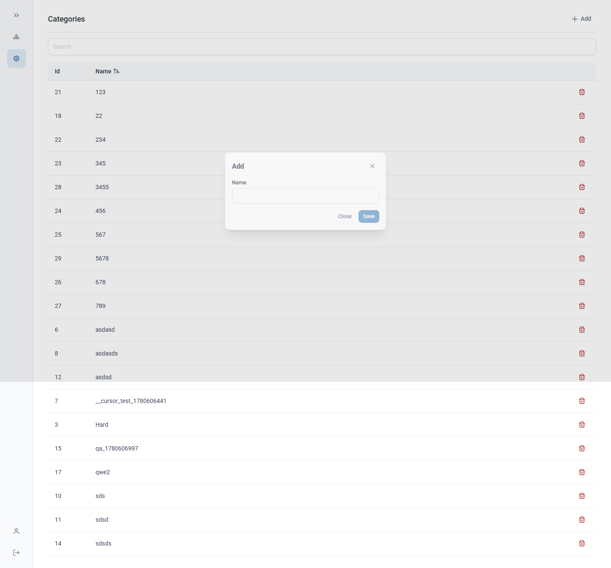 |
| Редактирование |  | 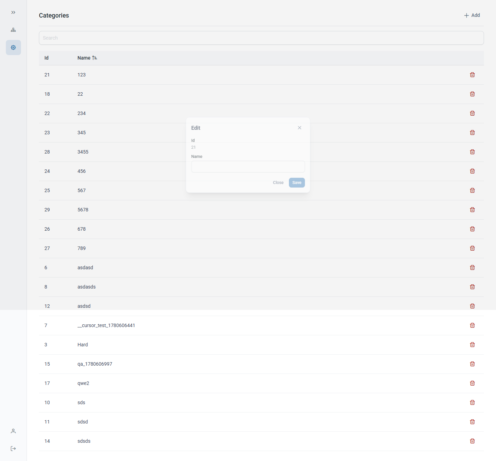 |

---

## 10. Асинхронная валидация имени

_Что сделано:_ `nameExistsValidator` (`shared/validators`) — `AsyncValidatorFn`:
`timer(350ms)` (debounce) → `switchMap` на `GET /front/categories/name-exists?id=&name=`
(отмена предыдущего запроса), `true` → ошибка `{ nameTaken: true }`. Пустое имя
отсекается `required` (запрос не дёргаем), ошибки сети — мягко (валидно). `id` —
текущей записи (Edit) или `null` (Add). Save заблокирован, пока форма невалидна
или идёт проверка (`pending`); в шаблоне — индикатор «Проверка имени…».

🖼️ Скриншот ввода имени в модалке: 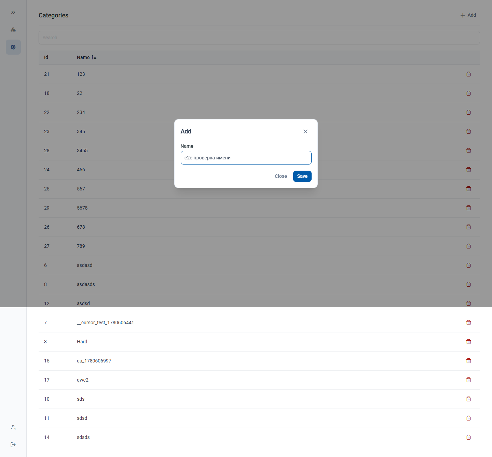

---

## 11. Удаление

_Что сделано:_ Иконка-корзина в строке (видна при `canEdit=true`) открывает
PrimeNG `ConfirmDialog` («Confirmation» / «Sure to delete this element?» /
Close + красная Delete). Подтверждение → `DELETE /front/categories/{id}` →
`store.removeFromList(id)` (без перезагрузки списка). Ошибка → toast, список не меняется.

| Макет | Реализация |
|---|---|
|  | 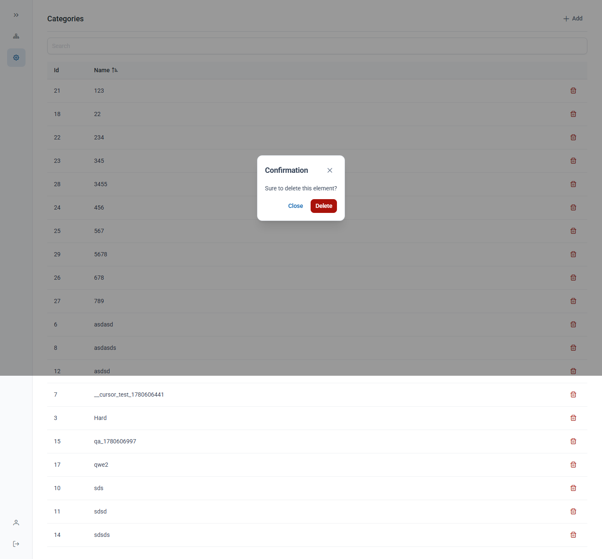 |

---

## 12. Тесты и покрытие

_Что сделано:_ Karma + Jasmine, **33 unit/component-теста, все зелёные**.
- Unit: `TokenStorage`, `AuthService` (logon успех/ошибка, refresh, logout),
  `authInterceptor` (заголовок; `401`→refresh→retry; провал refresh→logout),
  `authGuard`, `nameExistsValidator` (занято/свободно/пусто/ошибка),
  `CategoriesStore` (стоп пагинации при `len<PAGE_SIZE`, сброс по search, toggleSort,
  remove/upsert иммутабельность).
- Component: `LoginPage` (Field is required; серверная ошибка), `CategoryEditDialog`
  (режимы Add/Edit, отказ сохранять невалидную форму).
- Покрытие приложения (генерированный `core/api` исключён из метрики):
  **Statements 92.3%, Lines 92.7%, Branches 82.2%, Functions 83.9% — выше цели 80%.**
- E2E (Playwright): смоук экрана входа (без бэкенда) + полный авторизованный поток
  против живого бэкенда (логин `test/77777` → список → Add → Edit → Delete),
  он же снимает скриншоты в `docs/screenshots/`.

Запуск: `npm run test:ci` (unit+coverage), `npm run e2e` (Playwright).

---

## 13. Сборка

_Что сделано:_ `npm run build` (`ng build`, прод-конфиг) проходит **без ошибок и
предупреждений**; бюджет initial-бандла поднят до 900kB (PrimeNG). Вывод — `dist/recursion-ai`.

---

## Скриншоты приложения

Итоговая галерея работающего приложения (заполняется по мере готовности):

| # | Экран | Скриншот |
|---|---|---|
| 1 | Вход |  |
| 2 | Вход — обязательные поля |  |
| 3 | Вход — ошибка |  |
| 4 | Список |  |
| 5 | Добавление |  |
| 6 | Редактирование |  |
| 7 | Валидация имени |  |
| 8 | Удаление |  |

Скриншоты снимаются автоматически Playwright-спекой `e2e/screenshots.spec.ts`.
Прогон тестов и сборки см. разделы 12–13 (текстовые отчёты).

---

## Проблемы и решения

| Проблема | Решение |
|---|---|
| Дубли `operationId` в Swagger → `--validate-spec` падал | Генерация с `--skip-validate-spec` (затронуты только неиспользуемые эндпоинты). |
| Авто-barrel `core/api/api/api.ts` давал TS2308 (коллизии `*RequestParams`) | Barrel сведён к используемым сервисам + внесён в `.openapi-generator-ignore`. |
| Стили PrimeNG разрознены (`::ng-deep`, хардкод) | Все стили PrimeNG перенесены в design-токены пресета (`definePreset`, см. `core/config/theme.ts`): палитра primary, примитив `red`→`#a9120a` (danger), `formField.borderRadius` 8px (кнопки/инпуты), `content.borderRadius` 10px, токены `datatable.headerCell` (фон `#f9fafc`). `::ng-deep` убран. Документация сверена через Context7 (PrimeNG v20). |
| Полная ширина инпутов задавалась через `::ng-deep .p-password input` (login) и `.p-iconfield` (поиск) | Переведено на штатное свойство PrimeNG `fluid` (`<input pInputText fluid>`, `<p-password fluid>`, `<p-iconfield fluid>`); все `::ng-deep` удалены, дубли ширины убраны из SCSS/global. |
| Невалидные ключи токенов (`button.borderRadius`, `button…danger`) | Кнопки наследуют радиус из `form.field`; severity-цвета — из примитива `red`. Имена ключей валидируются TS-типами `@primeuix/themes`. |
| CORS при запросах к бэкенду с dev-origin | `proxy.conf.json` проксирует `/front` → бэкенд; фронт ходит относительными URL. |
| Низкое покрытие из-за генерированного клиента | `core/api/**` исключён из coverage (`codeCoverageExclude`). |
| Бюджет initial-бандла превышен из-за PrimeNG | Лимит поднят до 900kB/1.5MB в `angular.json`. |
